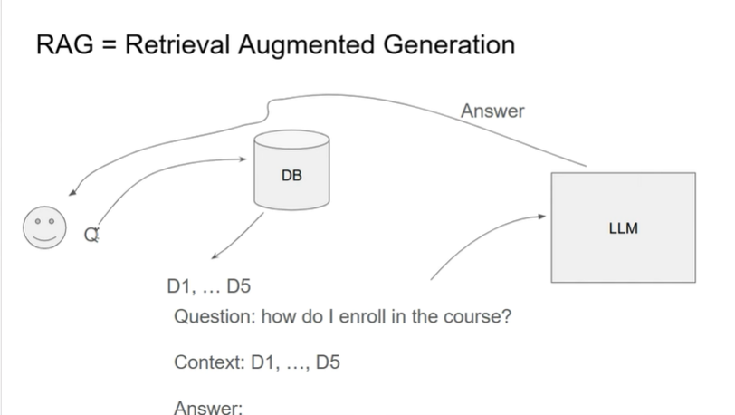

# rag-intro
1. RAG



Youtube: [link](https://www.youtube.com/watch?v=olvem333Bqo&t=107s)


1. Retrieval and Search
    Đầu tiên ta search documents có liên quan trong DB bằng minsearch
    minsearch hoạt động bằng cách search có Keywork có trong query. Ta có để đặt độ ưu tiên trong các trường dữ liệu

    ```python
    query = "Can I join the course if it has already started?"

    filter_dict = {"course": "data-engineering-zoomcamp"}
    boost_dict = {"question": 3, "text": 1, "section": 1}

    results = index.search(query, filter_dict, boost_dict)

    for result in results:
        print(result)
    ```
